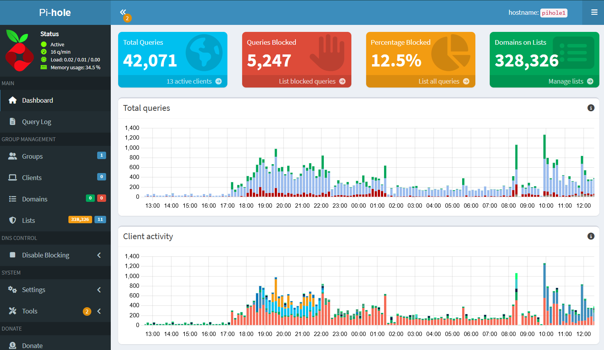
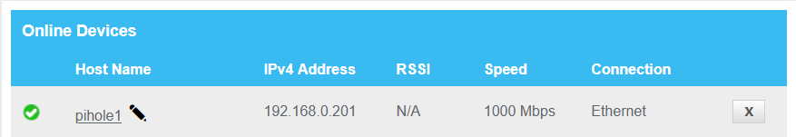
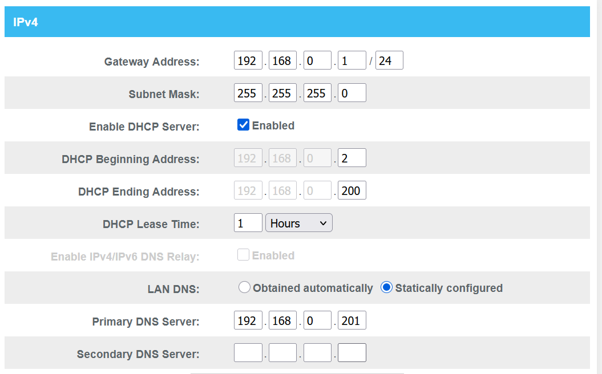

# Pi-hole DNS Home Lab

## Project Overview
This project documents my deployment of Pi-hole on a Raspberry Pi 5 to provide DNS filtering and ad blocking for my home network.

## Goals
- Install and configure Pi-hole on a Raspberry Pi
- Understand DNS and DHCP behavior in a real home network
- Configure router DNS settings
- Troubleshoot IP address changes and connectivity issues
- Document the lab in a professional GitHub format

## Lab Environment
- Raspberry Pi 5
- Pi-hole
- Home router
- Ethernet connection
- Windows laptop
- Local network: 192.168.0.0/24

## What I Built
I installed Pi-hole on a Raspberry Pi and configured it as a DNS filtering device for my home network. During the setup, I worked through DHCP and DNS configuration issues, including the Raspberry Pi receiving a different IP address than expected.

## Key Troubleshooting Moment
The Raspberry Pi was originally expected to use `192.168.0.201`, but it later appeared on the network as `192.168.0.117`. This helped reinforce the importance of DHCP reservations, static IP planning, and verifying device addresses directly from the router.

## Skills Demonstrated
- DNS fundamentals
- DHCP troubleshooting
- Raspberry Pi setup
- Home network configuration
- IP addressing
- Network documentation
- Troubleshooting connectivity issues

## Screenshots
## Final Working Environment

The completed Pi-hole deployment is running on a Raspberry Pi 5 and provides network-wide DNS filtering for 13 client devices. At the time of this screenshot, Pi-hole had processed over 42,000 DNS queries and blocked more than 5,000 requests.



## Network Diagram

During deployment I configured my home router to direct DNS traffic to a Raspberry Pi running pi-hole. Devices received their network configuration through DHCP and bagan sending DNS requests to Pi-hole. The result is nework-wide ad and domain filtering.
```text
             Internet
                 │
                 ▼
        ┌────────────────┐
        │ Home Router    │
        │ 192.168.0.1    │
        └────────────────┘
                 │
      ┌──────────┴──────────┐
      │                     │
      ▼                     ▼
┌──────────────┐    ┌────────────────┐
│ Raspberry Pi │    │ Client Devices │
│ Pi-hole      │    │ PCs, Phones,   │
│ 192.168.0.201│    │ TV, Xbox       │
└──────────────┘    └────────────────┘
```
## DHCP Reservation

A DHCP reservation was created to ensure the Raspberry Pi consistently receives the same IP address, preventing connectivity issues caused by changing DHCP assignments.



## DNS

The router was configured to distribute the Pi-hole host (192.168.0.201) as the primary DNS server for all devices on the network. DHCP remained enabled on the router, while the Pi-hole device was placed outside the DHCP address pool to maintain a consistent address assignment.



## Lessons Learned
- DNS changes can affect access to network resources if configured incorrectly.
- DHCP can assign a new IP address unless a reservation or static configuration is used.
- Router dashboards are useful for identifying device IP changes.
- A simple home lab can create real troubleshooting experience.

## Next Steps
- Add a DHCP reservation for the Raspberry Pi
- Identify unknown devices using nmap
- Improve network diagram
- Explore Unbound for recursive DNS
